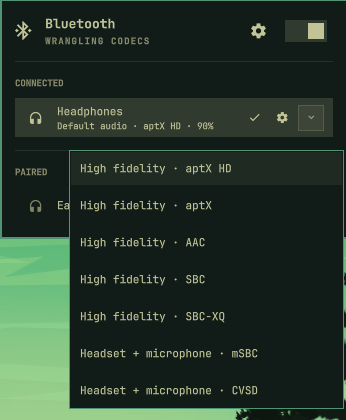
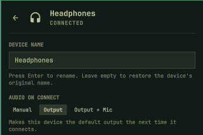

# Advanced Bluetooth Audio for Omarchy

Advanced Bluetooth Audio adds headset modes and per-device audio preferences to
Omarchy's Bluetooth panel.

See the active codec, choose between supported playback and microphone modes,
and decide what each device should do when it connects: leave your defaults
unchanged, become the output, or become both output and microphone.

Pairing failures include their reason and a retry action. Device details
provide rename, trust, block, supported wake controls, and confirmed forgetting.
It works independently. [Advanced Audio Control](https://github.com/ssupt/omarchy-audio-control)
adds application routing and shared audio integration.

## What it adds to Omarchy

Compared with the [stock Bluetooth panel in Omarchy 4.0.4](https://github.com/omacom/omarchy/blob/c668141e9c42b13c80c9ca4ea108e11708c5e8a5/shell/plugins/panels/bluetooth/Panel.qml):

| Stock panel | Advanced Bluetooth Audio adds |
| --- | --- |
| Device list, pairing, connection, and battery | Active codec and a selector for supported playback or headset modes |
| Selects the audio output after connecting a device from the panel | Per-device **Audio on connect** choices: Manual, Output, or Output + Microphone |
| Basic device actions | Failure reasons and retry, device details, and confirmed forgetting |

For example, keep a headset in a high-fidelity playback mode for music, then
select a headset-and-microphone mode for a call. Choose **Output** for a headset
that should play audio on reconnect while your desk microphone stays the default.
Choose **Output + Microphone** when the headset should handle both sides of a
call. A device without a microphone mode provides output only.

## Screenshots

<table>
  <tr><th>Supported audio modes</th><th>Audio on connect</th></tr>
  <tr>
    <td valign="top"><a href="screenshot-mode-selector.png"></a></td>
    <td valign="top"><a href="screenshot-audio-on-connect.png"></a></td>
  </tr>
</table>

## Controls

- Click a device row to connect or disconnect it. Click the audio action on a
  connected device to make it the default output; if its current mode exposes a
  microphone, that becomes the default input too.
- Click the arrow on a connected audio device to choose a supported mode. The
  menu describes the trade-off, such as **High fidelity · AAC** or
  **Headset + microphone · mSBC**. The selected mode is remembered per device.
- Open the gear on a device row, or right-click it, for device details. Under
  **Audio on connect**, choose **Manual** (the default), **Output**, or
  **Output + Microphone** for future connections.
- Retry a failed pairing or connection from its row. Cancel an active pairing
  attempt with the row's cancel button. Forgetting asks for confirmation.

The panel also supports keyboard navigation: `j`/`k` or Up/Down moves among
devices, `h`/`l` or Left/Right reaches row actions, Enter activates the selected
action, `x` opens Forget, and Escape closes. In device details, use Tab or arrow
keys to move among controls and Enter to edit or toggle them.

## Install

```bash
omarchy plugin add https://github.com/ssupt/omarchy-bluetooth-audio.git --enable
```

Enabling the plugin replaces the built-in `omarchy.bluetooth` widget in its
current bar position. Disabling or removing it restores the built-in widget.

```bash
omarchy plugin remove ssupt.bluetooth-audio
```

Requires `bluetoothctl`, `busctl`, `pactl`, `jq`, `timeout`, and `flock`, which
are part of a standard Omarchy installation. A prebuilt x86_64 Linux command
service ships with the plugin.

## Service architecture

Quickshell/QML draws the panel. A shared Rust service owns device actions,
their results, and saved choices across bar widgets on multiple monitors. An
action can finish after its panel closes; the service retains its outcome and
shows confirmed success or a useful failure when a panel returns. Audio mode
changes protect the old volume and mute state while the device switches modes.

With Advanced Audio Control installed, default-device changes wait for that
service's confirmed result and the live audio state. The panel can still use
its local helpers when the Bluetooth service is unavailable.

## Saved preferences

Under `~/.config/omarchy`, `audio-preferences.json` stores preferred devices and
profiles shared with Advanced Audio Control. Per-device connection policies
live in `bluetooth-audio-policies.json`; older shared-file policies migrate
automatically. Unsupported future schemas are left unchanged.

**Output + Microphone** selects and remembers a supported microphone mode when
needed. A manual mode change lasts for the current connection; the policy
applies again on the next connection. With Advanced Audio Control enabled,
device renames update its aliases and forgetting clears its saved audio routes.

## Contributing

The QML files own presentation and shared operation state; `backend/src/` owns
command execution, and `scripts/` contains system helpers. Tests and QML
fixtures live under `test/` and use temporary data and mock devices.
Use `Text.PlainText` for labels; external names and saved text can contain markup.
Use Rust/Cargo **1.85+**, Python, Node.js, jq, and Qt/Quickshell test tools.

```bash
cargo build --locked --release --manifest-path backend/Cargo.toml
python3 packaging/release.py --prepare . --binary backend/target/release/omarchy-bluetooth-service
./test/all
omarchy-plugin-validate .
```

Build in a development checkout outside the live plugin directory. Commit the
matching bundled binary and `backend-release.json` when changing runtime
sources. The release check rejects mismatched sources and binaries; docs and
test fixtures do not affect the runtime fingerprint.

The audio companion's `default.compat` request validates the live node ID and
name. Wait for its result before completing a default switch, and coordinate
releases when changing the shared preference or command contract.

More plugins by `ssupt`: [omarchy-plugins](https://github.com/ssupt/omarchy-plugins).
